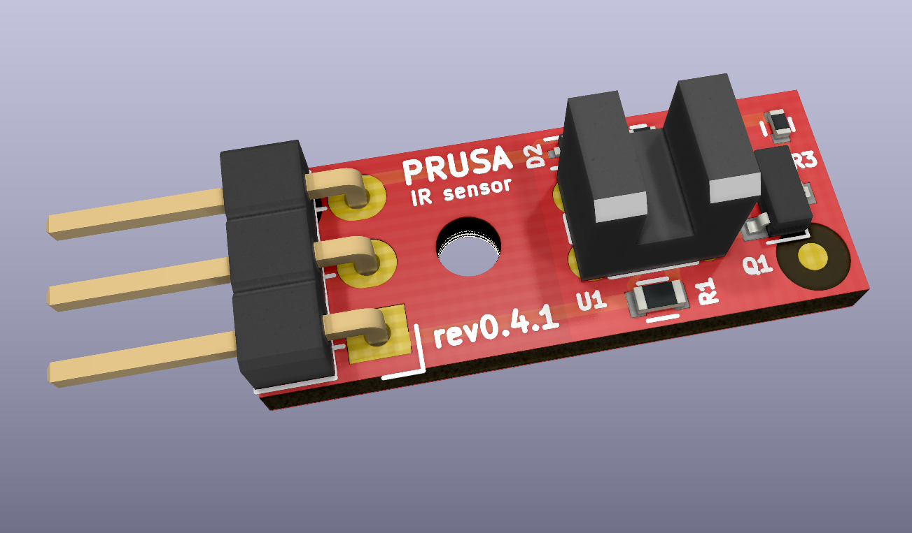

# PRUSA IR sensor board

KiCad PCB layout

* [Interactive bom](http://htmlpreview.github.io/?https://github.com/prusa3d/MKxS-IR-sensor/blob/master/rev.041/IR-endstop-0.4.1-ibom.html)
* [STEP 3D model](rev.041/IR-endstop-0.4.1.step)

