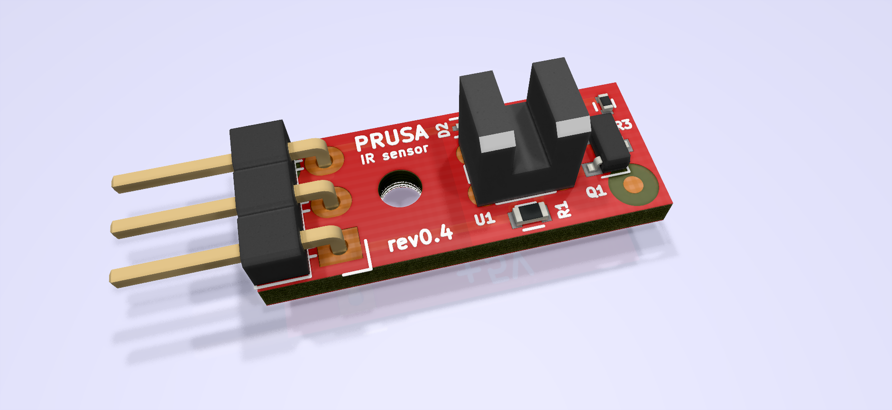

# PRUSA IR sensor board

KiCad PCB layout

* [Interactive bom](http://htmlpreview.github.io/?https://github.com/prusa3d/MKxS-IR-sensor/blob/master/rev.04/IR-endstop-04-ibom.html)
* [STEP 3D model](rev.04/IR-endstop-04.step)

